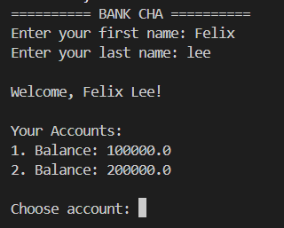
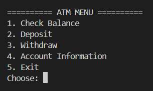
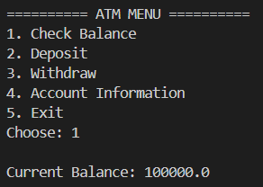
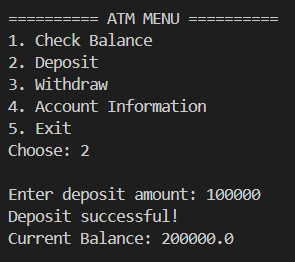
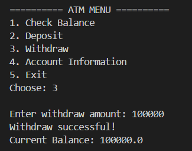
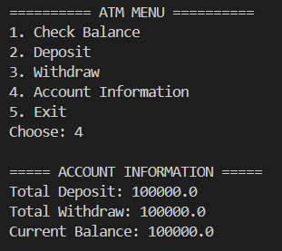
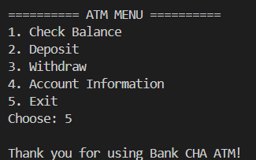

- Nama: Raissa Bunga Astrella.
- Student id: F1D02410087.

## Class Overview

- **`Account`** — Menyimpan saldo, total deposit, total withdraw.
  Method: `deposit()`, `withdraw()`, `getBalance()`, dll.
- **`Customer`** — Menyimpan nama depan/belakang & array rekening (maks 2).
  Method: `setaccount()`, `getAccount()`.
- **`Bank`** — Mengelola kumpulan nasabah dalam `ArrayList<Customer>`.
  Method: `addCustomer()`, `getCustomer()`.
- **`Bankdemo`** — Berisi `main()`, menyiapkan data nasabah contoh & menjalankan menu interaktif via `Scanner`.

## Demo Overview
### 1.Menu awal

- tampilan ketiga program meminta input nama customer
### 2.Menu Utama

- tampilan menu utama dengan berbagai pilihan fitur
### 3.Menu Check balance

- menampilkan current balance
### 4.Menu deposit

- menampilkan dan memasukkan deposit, serta menghitung total balance sekarang
### 5.Menu withdraw

- menampilkan dan memasukkan outcome serta menghitung total balance sekarang
### 6.Menu Account information

- menampilkan data terkini terkait akun, termasuk total depoit/income, total withdraw/ outcome dan total current balance
### 7.exit

- keluar dari program
