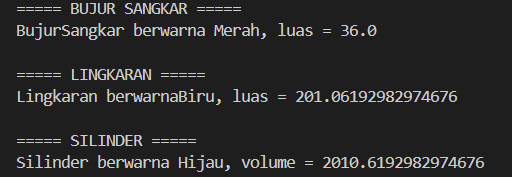

# OOP Exercise 1–3

## Informasi Kode

Hubungan antar-class dalam program:

```text
Bentuk
├── BujurSangkar
└── Lingkaran
    └── Silinder
```

Program ini menerapkan tiga konsep utama OOP, yakni **Encapsulation, Inheritance, dan Polymorphism**.

---

## 1. Encapsulation

Encapsulation diterapkan dengan membatasi akses langsung terhadap atribut dan menggunakan method untuk mengakses atau mengubah nilai atribut tersebut.

Contohnya pada class `Bentuk`:

```java
private String warna;

public String getWarna() {
    return warna;
}

public void setWarna(String warna) {
    this.warna = warna;
}
```

Atribut `warna` dibuat `private`, sehingga tidak dapat diakses secara langsung dari luar class. Untuk mengakses atau mengubah nilainya digunakan method `getWarna()` dan `setWarna()`.

Konsep yang sama juga diterapkan pada atribut `sisi` pada class `BujurSangkar`, `radius` pada class `Lingkaran`, dan `tinggi` pada class `Silinder`.

---

## 2. Inheritance

Inheritance atau pewarisan diterapkan menggunakan keyword `extends`.

Class `BujurSangkar` merupakan turunan dari class `Bentuk`:

```java
public class BujurSangkar extends Bentuk
```

Class `Lingkaran` juga merupakan turunan dari class `Bentuk`:

```java
public class Lingkaran extends Bentuk
```

class `Silinder` merupakan turunan dari class `Lingkaran`:

```java
public class Silinder extends Lingkaran
```

Dengan inheritance, class turunan dapat menggunakan atribut dan method yang diwariskan dari class induknya.

Contohnya pada constructor `Silinder`:

```java
public Silinder(double tinggi, double radius, String warna) {
    super(radius, warna);
    this.tinggi = tinggi;
}
```

`super()` digunakan untuk memanggil constructor dari class induk, yaitu `Lingkaran`.

## 3. Polymorphism

Polymorphism diterapkan melalui method `printInfo()` yang terdapat pada beberapa class.

Pada class `Bentuk`:

```java
public void printInfo() {
    System.out.println("Bentuk berwarna " +  warna);
}
```

method `printInfo()` dibuat kembali pada class turunannya dengan isi yang berbeda.

Contohnya pada class `BujurSangkar`:

```java
public void printInfo() {
    System.out.println( "BujurSangkar berwarna " + warna + ", luas = " + hitungLuas());
}
```

Class `Lingkaran` dan `Silinder` juga memiliki method `printInfo()` dengan output yang disesuaikan dengan masing-masing bentuk.

---

## Screenshot

### Hasil Program

